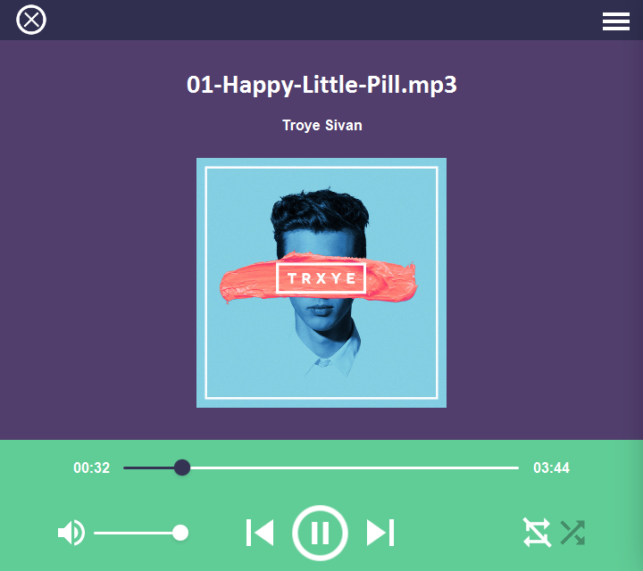

# JetTunes

## Description:
 JetTunes is an open source desktop music player made using javafx & JFoenix.

## Screenshots:

 
 

## TODO:

- [ ] Make player support other formats than MP3.
- [ ] Skip duplicated songs in music lists.
- [x] Saving music list & parameters in DB or JSON file (currently saved in text for simplicity).
- [ ] Adding more custom parameters and music options.
- [ ] Making the music visualizer better.
- [ ] Adding music lyrics API.

## Tools & languages: 

* IntellijIdea (IDE).
* Java (Logic code).
* FXML (Design).
* Paint.Net (Image editting).
* JFoenix (main UI library).

## Usage:

* Run jetTunes.exe found in releases.
* First time usage will require you to show where your music folder exists.
* After saving your music list, you won't be asked for it again unless
  you decide to update it from the music list drawer.

## Contribution:

Feel free to `fork` this project and add whatever you like. If you have any suggestions or any comments please feel free to contact me or to open an issue, use free license art assets please.

## Team:

[Jetlighters](https://github.com/JetLightStudio) having fun.
